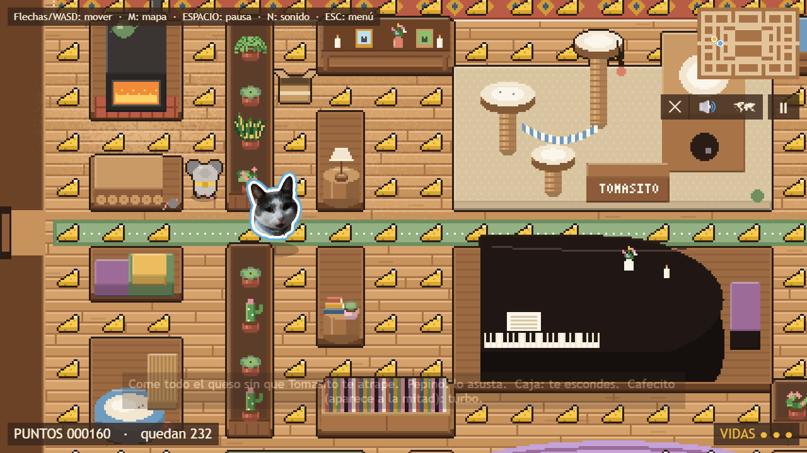
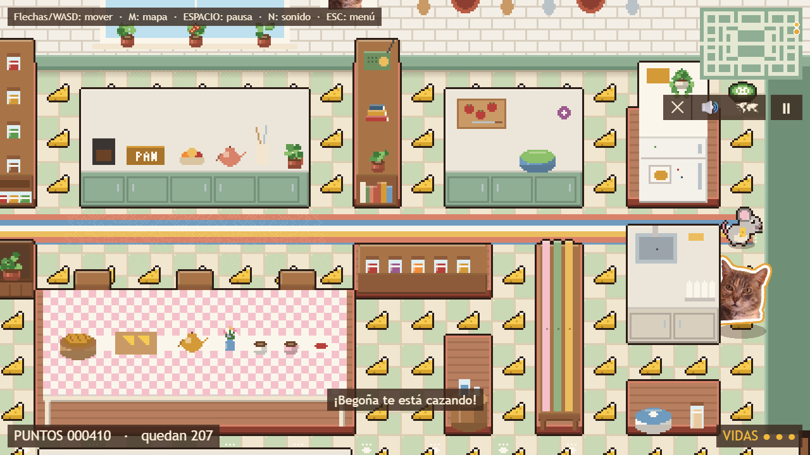
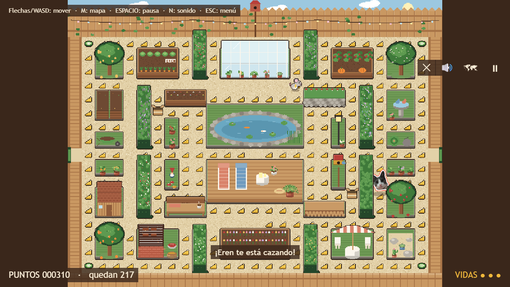
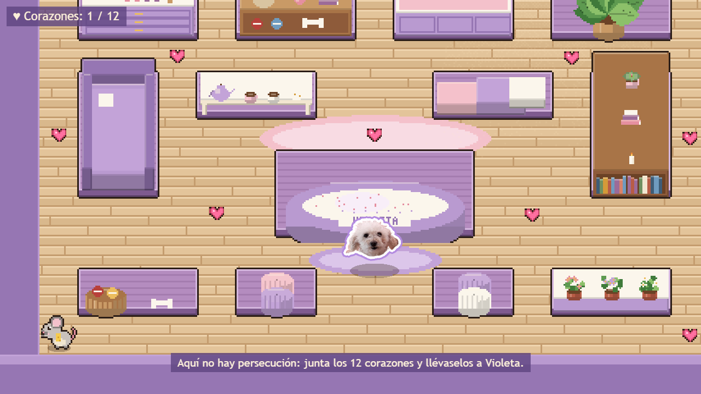
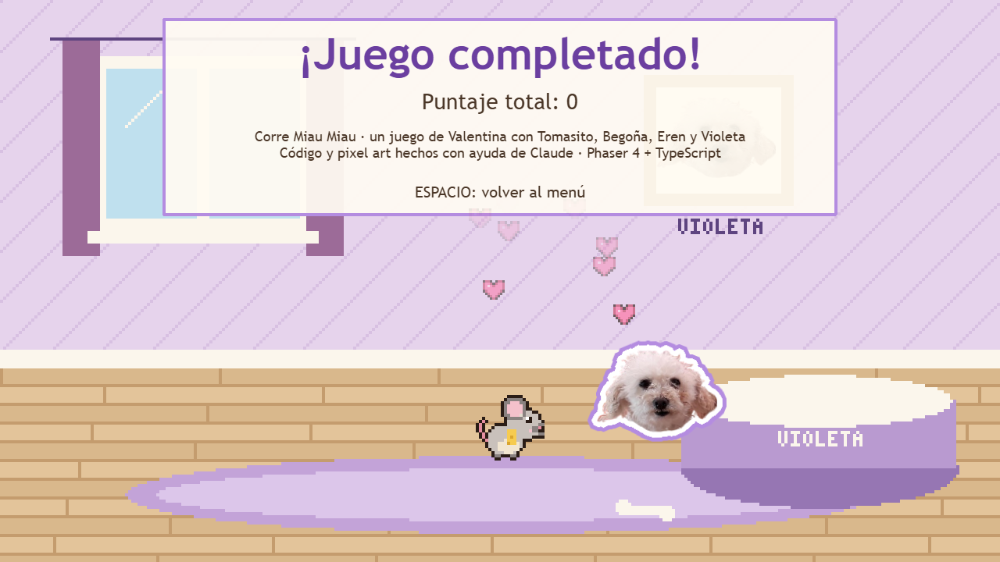
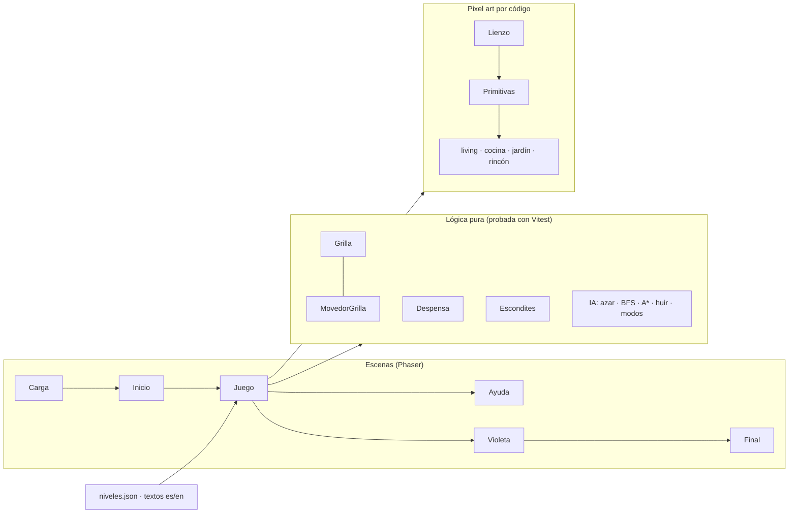

# Corre Miau Miau

### ▶ [Jugar en el navegador](https://corre-miau-miau.vercel.app/) · [Descargar para Windows / Mac](https://github.com/vaguzzel/corre-miau-miau/releases/latest)

También disponible en [GitHub Pages](https://vaguzzel.github.io/corre-miau-miau/).

Juego tipo Pac-Man en pixel art, en vista 3/4. Controlas a **Quesito**, un ratón que recorre la casa comiendo queso mientras **Tomasito**, **Begoña** y **Eren** (mis gatos, con sus fotos reales como stickers) lo persiguen. Cada gato piensa distinto: al azar, con BFS y con A\*. Al final, un nivel tranquilo con **Violeta**, mi poodle.



| La cocina de Begoña | El jardín de Eren (mapa completo) |
|---|---|
|  |  |

| El rincón de Violeta | Final |
|---|---|
|  |  |

## Cómo se juega

| Tecla | Acción |
|---|---|
| Flechas o WASD | Mover a Quesito (en celular: deslizar el dedo) |
| M | Ver el mapa completo |
| ESPACIO | Pausa |
| N | Sonido sí / no |
| ESC | Volver al menú |
| I (en el menú) | Español / English |

Come todo el queso sin que el gato te atrape. **Pepino**: el gato se asusta y huye (tócalo para +200). **Caja de cartón**: te escondes y el gato pierde tu rastro. **Cafecito**: aparece a la mitad del nivel y da turbo.

## Tecnologías

| Tecnología | Para qué | Por qué la elegí |
|---|---|---|
| [Phaser 4](https://phaser.io) + TypeScript | Motor del juego | Corre directo en el navegador; TypeScript avisa errores antes de ejecutar |
| Vite | Servidor de desarrollo y build | Rápido y simple |
| Vitest | Pruebas automáticas | Probar la IA y las reglas sin abrir el juego |
| Pixel art hecho con código | Todo el arte (muebles, pisos, Quesito) | Sin comprar assets; se ajusta píxel a píxel desde el código |
| Web Audio API | Sonidos y música | Generados por código, sin archivos de audio |
| vite-plugin-pwa | App instalable y sin internet | Casi sin trabajo extra |
| Tauri 2 | Versión de escritorio | Apps livianas; el mismo código web |
| GitHub Actions + Pages | Publicación automática | Cada cambio se prueba y se publica solo |

## Qué aprendí

- **Búsqueda en grafos:** BFS (camino más corto en ondas) y **A\*** con una **cola de prioridad (heap)** y heurística Manhattan.
- **IA de videojuegos:** tres personalidades (azar controlado, perseguidor, el que te corta el paso), huida con mapas de distancias y un **horario de modos** patrullar/cazar como en el Pac-Man original.
- **Máquinas de estados:** fases de la partida y estados del gato (patrullar, cazar, asustado, en su cama).
- **Vista 3/4 y y-sort:** ordenar por profundidad para que los personajes pasen por delante y por detrás de los muebles.
- **Gráficos por código:** un lienzo de píxeles propio, contornos automáticos, luz tramada y una **transformada de distancia** para los bordes de sticker de las fotos.
- **Arquitectura:** lógica pura separada de Phaser para poder probarla (**36 pruebas automáticas**), configuración en JSON y textos en dos idiomas.
- **Publicar un producto:** GitHub Actions, GitHub Pages, PWA y app de escritorio con Tauri.

Todo está explicado paso a paso en **[docs/como-funciona.md](docs/como-funciona.md)**, y el plan original en [docs/plan.md](docs/plan.md).

## Cómo está organizado el código



```
src/
├─ escenas/     Carga, Inicio (menú), Juego, Ayuda (interfaz), Violeta, Final
├─ ia/          azar.ts · bfs.ts · astar.ts · huir.ts · modos.ts
├─ sistemas/    grilla, movimiento, despensa, cajas, sonido, guardado
├─ arte/        Lienzo de píxeles, paleta, primitivas y las 4 habitaciones
├─ niveles/     qué habitación, gato e IA usa cada nivel
├─ config/      niveles.json: velocidades, tiempos y puntajes
└─ i18n/        textos en español e inglés
tools/          exportar el arte a PNG y generar los íconos
src-tauri/      versión de escritorio
```

## Cómo correrlo

```bash
npm install
npm run dev      # abre el juego en http://localhost:5173
npm test         # corre las pruebas
npm run build    # genera la versión para publicar en dist/
npm run arte     # exporta el pixel art a tools/salida/ para revisarlo
```

Para probar un nivel sin pasar por el menú: `http://localhost:5173/?nivel=eren` (o `tomasito`, `begona`, `violeta`, `final`).

**Versión de escritorio:** se compila sola en GitHub al crear una etiqueta (`git tag v1.0.1 && git push --tags`). Para compilarla en tu computador hace falta [Rust](https://www.rust-lang.org/tools/install) y luego `npm run tauri build`.

## Créditos y licencia

- Idea, fotos y dirección: Valentina.
- Código y pixel art hechos con ayuda de Claude (IA de Anthropic).
- Sonidos y música generados por código; no se usaron assets de terceros.
- **Código:** licencia MIT. **Las fotos de Tomasito, Begoña, Eren y Violeta son de su dueña y no se pueden reutilizar.**
