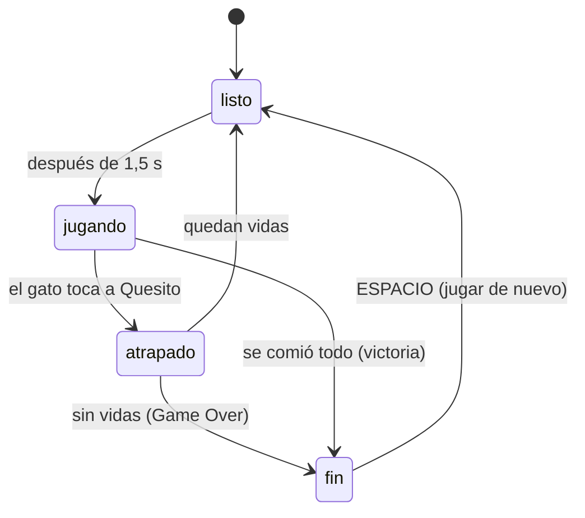

# Cómo funciona Corre Miau Miau

Este documento explica, en lenguaje simple, cada mecánica y algoritmo del juego: qué hace, dónde está el código y por qué se hizo así. Se actualiza cada vez que cambia algo.

> Los números (velocidades, probabilidades, tiempos, puntos) no están escritos en el código: viven en [`src/config/niveles.json`](../src/config/niveles.json). Así se ajusta la dificultad sin tocar la lógica.

---

## 1. El mapa es una grilla

**Archivo:** [`src/mapa/mapas.ts`](../src/mapa/mapas.ts) y [`src/sistemas/grilla.ts`](../src/sistemas/grilla.ts)

El laberinto se escribe como texto: cada carácter es una casilla (27 columnas × 19 filas).

| Carácter | Significa |
|---|---|
| `#` | muro o mueble |
| `.` | pasillo con queso |
| `o` | pepino |
| `c` | cafecito |
| `b` | caja de cartón |
| `=` | gatera (túnel lateral) |
| `Q` / `G` | donde parten Quesito y el gato |

La clase `Grilla` lee ese texto una vez y responde preguntas simples:

- `esMuro(x, y)`: ¿esta casilla está bloqueada?
- `vecino(x, y, dir)`: ¿qué casilla hay al lado en esa dirección?
- `puedeMover(x, y, dir)`: ¿puedo avanzar hacia allá?

**Las gateras:** `vecino` usa el operador módulo (`%`) para "dar la vuelta": si sales por la columna 0 hacia la izquierda, llegas a la columna 26. Así funcionan los túneles sin código especial.

Todo esto es **lógica pura**: no usa Phaser, así que se puede probar con tests automáticos.

---

## 2. Moverse de casilla en casilla

**Archivo:** [`src/sistemas/MovedorGrilla.ts`](../src/sistemas/MovedorGrilla.ts)

Quesito y los gatos usan la misma clase, `MovedorGrilla`. Cada personaje guarda:

- la casilla de donde salió (`x`, `y`),
- la dirección en que va (`dir`),
- cuánto avanzó hacia la casilla siguiente (`progreso`, de 0 a 1).

Cada fotograma avanza `velocidad × tiempo` casillas. La posición en pantalla es `casilla + dirección × progreso`, por eso **se ve suave aunque la lógica sea por casillas**.

Tres reglas hacen que se sienta bien de jugar, igual que en Pac-Man:

1. **Las decisiones se toman al llegar al centro de una casilla.** Nunca se gira a mitad de camino (así no se choca con esquinas).
2. **El giro queda guardado.** Si aprietas "arriba" antes de llegar al cruce, la dirección se guarda en `pedida` y se aplica apenas se pueda.
3. **Darse vuelta es inmediato.** Si pides la dirección contraria a mitad de camino, se intercambian origen y destino y el progreso pasa a `1 − progreso`.

Cada vez que llega al centro de una casilla, llama a `alLlegar(x, y)`. Quesito lo usa para comer; los gatos, para decidir hacia dónde seguir.

---

## 3. Cómo persigue Tomasito (nivel 1)

**Archivos:** [`src/ia/azar.ts`](../src/ia/azar.ts) y [`src/ia/bfs.ts`](../src/ia/bfs.ts)

Cada vez que Tomasito llega a una casilla, tira un "dado":

- **85% de las veces persigue:** sigue el camino más corto hacia Quesito, calculado con **BFS**.
- **15% de las veces se distrae:** elige al azar uno de los caminos libres.
- **Nunca se da vuelta** (salvo en un callejón sin salida), igual que los fantasmas de Pac-Man. Así no tiembla yendo y viniendo en un cruce, y si lo pasas por detrás tiene que dar toda la vuelta.

### BFS: búsqueda en anchura

BFS encuentra el camino más corto en un laberinto. Funciona como una **onda en el agua**:

1. Parte en la casilla del gato.
2. Visita todas las casillas a 1 paso, después todas las que están a 2 pasos, después a 3… usando una **cola** (el primero que entra es el primero que sale).
3. Marca cada casilla como visitada para no repetirla.
4. La primera vez que la onda toca a Quesito, ese es el camino más corto.

Truco del código: en vez de guardar el camino completo, cada casilla recuerda **con qué primer paso se llegó a ella**. Cuando la onda encuentra a Quesito, ese primer paso es la respuesta. El gato vuelve a calcular en cada casilla, así que siempre sigue a Quesito aunque se mueva.

- **Costo:** visita cada casilla una vez como máximo. El mapa tiene unas 300 casillas libres, así que es instantáneo.
- **Considera las gateras:** si el túnel es más corto, lo usa.
- **Por qué no "línea recta":** la primera versión elegía la casilla más cerca en línea recta de Quesito, pero cualquier muro lo despistaba. BFS recorre los pasillos de verdad.

### La siesta

Cada 18 a 28 segundos (un número al azar en ese rango), Tomasito se duerme 1,5 segundos: se queda quieto y su cabeza se inclina. Es su "personalidad" y le da respiro al jugador.

### Más lento en las gateras

Dentro de un túnel el gato va al 60% de su velocidad, como en Pac-Man: los túneles son una vía de escape para Quesito.

---

## 4. Atrapar a Quesito

**Archivo:** [`src/escenas/Juego.ts`](../src/escenas/Juego.ts), método `seTocan`

Se mide la distancia entre la posición continua de Quesito y la del gato. Si es menor que 0,6 casillas (`radioAtrapar`), el gato lo atrapó. En horizontal se usa la distancia más corta considerando la gatera, para que el túnel no sea un escondite mágico.

Al ser atrapado:

1. Se pierde una vida y el gato celebra.
2. Si quedan vidas, los dos vuelven a su casilla de inicio. El queso comido no vuelve.
3. Si no quedan, aparece **GAME OVER**.

---

## 5. Queso, puntaje y ganar

**Archivo:** [`src/sistemas/Despensa.ts`](../src/sistemas/Despensa.ts)

La `Despensa` guarda qué objeto hay en cada casilla (en un `Map` con clave `"x,y"`) y el puntaje.

| Objeto | Puntos | ¿Cuenta para ganar? |
|---|---|---|
| Queso | 10 | Sí |
| Pepino | 50 | Sí |
| Cafecito | 100 | No |
| Caja | — | No (no se come) |

Se gana cuando no queda queso ni pepinos. El cafecito es opcional.

---

## 6. Fases de una partida

**Archivo:** `Juego.ts`, tipo `Fase`

Una **máquina de estados** simple controla qué puede pasar en cada momento:

La pausa (ESPACIO) es aparte: congela cualquier fase.

---

## 7. Cámara, mini-mapa y mapa completo

- **Cámara:** sigue a Quesito con suavizado (`startFollow` con factor 0,12) y no sale de los bordes del mapa. El zoom es ×3, un número entero, para que los píxeles queden cuadrados.
- **Mini-mapa:** es una **segunda cámara** de Phaser con zoom chico. Para que no muestre el pixel art achicado (se vería como ruido), cada cámara ignora cosas distintas:
  - la cámara principal ignora un dibujo simplificado del laberinto (cuadros de color) y dos puntos (Quesito en amarillo, el gato en su color);
  - la cámara del mini-mapa ignora la capa del mundo y solo ve ese dibujo simplificado.
- **Mapa completo (M):** la cámara deja de seguir a Quesito y hace zoom para mostrar la habitación entera. El juego sigue corriendo.

---

## 8. Controles

| Tecla | Acción |
|---|---|
| Flechas o WASD | Mover a Quesito |
| M | Mapa completo / volver a la cámara |
| ESPACIO | Pausa · al terminar: siguiente nivel o reintentar |
| N | Sonido sí / no |
| ESC | Volver a elegir nivel |
| I (en el menú) | Español / English |
| Deslizar el dedo | Mover a Quesito (celular) |

---

## 9. Pixel art hecho con código

**Archivos:** [`src/arte/`](../src/arte/)

El arte no está dibujado en un programa: está **escrito en código**, píxel a píxel.

- [`paleta.ts`](../src/arte/paleta.ts): los únicos colores permitidos. Una paleta fija hace que todo combine.
- [`Lienzo.ts`](../src/arte/Lienzo.ts): una "hoja" de píxeles en memoria con herramientas básicas: rectángulo, óvalo, línea (algoritmo de **Bresenham**), tramado (dithering) y **contorno automático**, que pinta de oscuro cada píxel vacío que toca un píxel dibujado.
- [`primitivas.ts`](../src/arte/primitivas.ts): piezas reutilizables en **vista 3/4**:
  - una caja (mueble) tiene **tapa** (vista desde arriba, subida `alto` píxeles) y **cara frontal** (su altura);
  - un cilindro (maceta, taza, puf) es un rectángulo con un óvalo abajo y otro arriba;
  - la luz viene de arriba a la izquierda: bordes superiores e izquierdos más claros, derechos e inferiores más oscuros.
- [`personajes.ts`](../src/arte/personajes.ts): Quesito (frente, espalda y lado, con dos pasos) y los objetos.
- **Números "al azar" que siempre salen iguales:** la función `hash(a, b)` da un número entre 0 y 1 que depende solo de sus entradas. Sirve para variar hojas y libros sin que el dibujo cambie cada vez que se abre el juego.

El mismo código dibuja en el juego y en Node: `npm run arte` exporta los dibujos a `tools/salida/` para revisarlos como imagen.

### El living

**Archivo:** [`src/arte/living.ts`](../src/arte/living.ts)

- `BLOQUES` lista los 36 muebles como rectángulos `[columna, fila, ancho, alto]`. Una prueba automática confirma que calzan **exactamente** con los muros del mapa: ningún mueble tapa un pasillo y ningún muro queda sin mueble.
- Cada mueble se dibuja en su propio lienzo, con margen hacia arriba para lo alto (lámparas, plantas, el castillo de Tomasito).
- `pisoLiving` dibuja en un solo lienzo el piso de tablas, la pared del fondo (papel mural, zócalo, ventanas, guirnalda), los muros laterales vistos desde arriba, las alfombras, el felpudo y la luz de la estufa y las lámparas.
- **La luz es un tramado:** en vez de un degradado suave (que no es pixel art), se aclaran píxeles sueltos. Mientras más cerca de la fuente, más píxeles se aclaran.
- La pared del fondo mide 40 píxeles más que la fila 0 (`ALTO_PARED`): en la vista 3/4 se ve de frente, así que necesita altura.

## 10. Vista 3/4 y orden de profundidad (y-sort)

**Archivo:** [`src/escenas/Juego.ts`](../src/escenas/Juego.ts), métodos `dibujarHabitacion` y `actualizarSprites`

En la vista 3/4, un mueble tapa lo que está **detrás** (más arriba en pantalla), y lo que está **delante** (más abajo) lo tapa a él. La regla es simple: **se dibuja primero lo que tiene la base más arriba**.

- Cada mueble tiene como profundidad la `y` de su base (el borde de abajo de su huella).
- Cada personaje tiene como profundidad la `y` de sus pies, que se actualiza en cada fotograma.
- Todos van en una misma **capa** (`Layer`) de Phaser, que los ordena por profundidad automáticamente.

Resultado: si Quesito camina por el pasillo de arriba de un sofá, el respaldo le tapa los pies; si camina por el de abajo, él tapa el sofá.

Casos especiales:

| Qué | Profundidad | Por qué |
|---|---|---|
| Piso y paredes | −10000 | Siempre al fondo |
| Queso, pepino, cafecito | −5000 | Están pegados al piso |
| Caja de cartón | su base | Tiene altura, como un mueble |
| Muro de abajo | 100000 | Es lo más cercano a la cámara |

## 11. Las fotos como stickers

**Archivo:** [`src/arte/texturas.ts`](../src/arte/texturas.ts), función `crearSticker`

El borde blanco y el borde de color alrededor de cada foto se generan en el juego, a partir del PNG recortado, con una **transformada de distancia**:

1. Se marca con distancia 0 cada píxel donde la foto es opaca.
2. Se recorre la imagen dos veces (de arriba a la izquierda y de abajo a la derecha) calculando, para cada píxel vacío, la distancia a la foto más cercana. Los pasos rectos cuentan 1 y los diagonales √2 (método de "chaflán").
3. Los píxeles a 7 o menos de distancia se pintan blancos; los de 7 a 12, del color de la mascota. El último píxel se suaviza para que el borde no quede serrucho.
4. Encima se dibuja la foto.

Así cualquier foto nueva recibe su borde automáticamente, sin editarla a mano. Las fotos usan filtro suave (LINEAR) para verse nítidas, mientras el pixel art usa filtro de píxel (NEAREST).

---

## 12. Objetos especiales

**Archivos:** [`src/ia/huir.ts`](../src/ia/huir.ts), [`src/sistemas/Escondites.ts`](../src/sistemas/Escondites.ts) y `Juego.ts` (métodos `comer`, `asustarGato`, `entrarCaja`, `mostrarCafe`)

### Pepino: el gato se asusta

1. Al comerlo, el gato **se da vuelta de inmediato** (como los fantasmas de Pac-Man), despierta si dormía, se pone azul y tiembla.
2. Durante el susto (8 s con Tomasito) **huye**. En cada cruce elige el camino que lo deja **más lejos de Quesito, contando pasos reales por los pasillos**. Para eso se usa `mapaDistancias`: el mismo BFS, pero en vez de parar al encontrar algo, recorre todo el mapa y anota a cuántos pasos de Quesito está cada casilla.
3. Va al 60% de su velocidad. Los últimos 2 segundos parpadea para avisar que el susto se acaba.
4. Si Quesito lo toca mientras está asustado: **+200 puntos** y el gato "corre a su cama". Desaparece y vuelve a su casilla de inicio 3 segundos después.

### Caja de cartón: esconderse

1. Quesito entra a la caja pasando por su casilla. Se **detiene solo** adentro (`MovedorGrilla.detener()`) y solo se le ven las orejas.
2. Mientras está escondido:
   - el gato no puede atraparlo;
   - el gato **pierde el rastro**: su probabilidad de perseguir baja a 0 y pasea al azar.
3. Para salir, basta moverse. Si se queda más de 4 segundos, "se asoma" y vuelve a estar a la vista, aunque siga quieto.
4. Cada caja sirve **2 veces por vida**. Los usos vuelven al perder una vida. La clase `Escondites` lleva esa cuenta y el tiempo, y tiene pruebas propias.

### Cafecito: turbo

1. **No está al comienzo:** aparece una sola vez, en el centro del mapa, cuando queda la mitad del queso, y se va si no lo tomas en 10 segundos.
2. Al tomarlo, Quesito corre un 30% más rápido por 5 segundos y deja una estela de polvo.

### Avisos

La primera vez que pasa cada cosa (empezar, pepino, caja, cafecito), aparece abajo un mensaje que explica qué hace. Funciona como un tutorial que no interrumpe el juego. Arriba al centro, un cartel muestra los efectos activos y cuántos segundos les quedan.

## 13. Muros claros: las tarimas

Cada mueble se dibuja sobre una **tarima de madera oscura** que cubre exactamente las casillas que bloquea. Así, aunque un mueble no llene todo su espacio (un piano de cola, unas plantas, una mesa redonda), se ve con claridad dónde no se puede pasar. La regla visual es simple: **piso de tablas = pasillo; tarima = muro**.

## 14. Los tres gatos: tres inteligencias distintas

**Archivos:** [`src/niveles/niveles.ts`](../src/niveles/niveles.ts), [`src/ia/`](../src/ia/) y `Juego.ts` (método `decidirGato`)

Cada nivel es la misma escena (`Juego`) con otra configuración: otra habitación, otro gato y otra IA. El cerebro del gato decide en cada casilla, en este orden de prioridad:

1. **Asustado** (pepino) → huye (sección 12).
2. **Quesito escondido** (caja) → pasea al azar.
3. **Patrullando** → va a su rincón por el camino más corto (BFS).
4. **Cazando** → usa la IA de su nivel:

| Gato | Velocidad | IA al cazar | Qué aprendes |
|---|---|---|---|
| Tomasito | 75% | BFS el 85% de las veces, al azar el resto; siestas | Grafos, BFS, azar controlado |
| Begoña | 95% | **BFS** siempre, hacia Quesito | Colas, camino más corto |
| Eren | 110% | **A\*** hacia 4 casillas **delante** de Quesito | Heurísticas, colas de prioridad |

### Patrullar y cazar (Begoña y Eren)

**Archivo:** [`src/ia/modos.ts`](../src/ia/modos.ts)

Como los fantasmas del Pac-Man original, Begoña y Eren no persiguen todo el tiempo: siguen un **horario de modos**. Por ejemplo, Begoña patrulla su rincón 7 s, caza 20 s, patrulla 7 s, caza 20 s, patrulla 5 s y después caza para siempre. En cada cambio de modo el gato **se da vuelta**, igual que en Pac-Man: así el jugador nota el cambio y tiene un respiro.

### A\* (Eren)

**Archivo:** [`src/ia/astar.ts`](../src/ia/astar.ts)

A\* es como BFS, pero en vez de explorar en ondas parejas, **explora primero lo que parece más cerca de la meta**. A cada casilla le da un puntaje `f = g + h`:

- `g`: pasos ya caminados desde el gato;
- `h`: estimación de lo que falta (distancia **Manhattan**: cuántas casillas en horizontal más cuántas en vertical, considerando el atajo de las gateras).

Las casillas por revisar esperan en una **cola de prioridad** implementada con un **montículo binario (heap)**: siempre entrega la de menor `f` en tiempo logarítmico. Como `h` nunca sobreestima, A\* encuentra el camino más corto igual que BFS (hay una prueba que lo confirma), pero visitando menos casillas.

**El truco de Eren:** no apunta a Quesito, sino a la casilla que está **4 pasos delante** de él, en la dirección en que corre (`casillaAdelante`). Por eso no te sigue: **te corta el paso**. Es la estrategia de Pinky, el fantasma rosado de Pac-Man.

## 15. El final: el rincón de Violeta

**Archivos:** [`src/escenas/Violeta.ts`](../src/escenas/Violeta.ts), [`src/arte/rincon.ts`](../src/arte/rincon.ts) y [`src/escenas/Final.ts`](../src/escenas/Final.ts)

- Tiene **su propio mapa** (19×13). En vez de escribirlo a mano, se **arma a partir de la lista de muebles**: se parte de un cuarto vacío y se pone un muro donde hay mueble. Así el mapa y el dibujo nunca se desalinean. Una prueba confirma que se puede llegar a los 12 corazones y a Violeta.
- No hay gato: Quesito junta los corazones y, cuando los tiene todos, toca a Violeta. Si llega antes, Violeta ladra y avisa que faltan.
- La **escena final** es una línea de tiempo: se acerca → Violeta ladra → Quesito duda y retrocede → vuelve con un corazón → se abrazan con lluvia de corazones → créditos y puntaje total.
- La interfaz usa una **segunda cámara sin zoom**: la principal (×3) ignora los textos y la de interfaz ignora el mundo.

## 16. Sonido sin archivos

**Archivo:** [`src/sistemas/Sonido.ts`](../src/sistemas/Sonido.ts)

Todos los sonidos se **generan con la Web Audio API**: cada efecto es una secuencia de notas (frecuencia, duración y forma de onda: cuadrada, triangular, sierra o seno).

- Comer queso alterna dos notas, como el "waka waka" de Pac-Man.
- La música de fondo son acordes suaves y una melodía de 32 pasos. Para que no se corte si el juego se pone lento, se **programa por adelantado**: cada 200 ms se agendan las notas de los próximos 600 ms en el reloj del audio.
- Los navegadores solo permiten sonido después de una tecla o un clic, por eso el audio se activa con la primera interacción.
- **N** silencia o activa el sonido, y queda guardado.

## 17. Idiomas, guardado y controles

- **Español e inglés** ([`src/i18n/textos.ts`](../src/i18n/textos.ts)): todos los textos están en dos diccionarios con las mismas claves. TypeScript obliga a que el inglés tenga exactamente las mismas claves que el español, así que no puede faltar ninguna traducción. `t("clave", { g: "Eren" })` reemplaza las `{llaves}`. **I** cambia el idioma en el menú.
- **Guardado** ([`src/sistemas/Guardado.ts`](../src/sistemas/Guardado.ts)): récord por nivel, niveles completados, idioma y sonido se guardan en `localStorage`. Todo va envuelto en `try/catch`: si el navegador no deja guardar (modo incógnito), el juego sigue funcionando.
- **Vida extra** cada 10.000 puntos.
- **Celular:** deslizar el dedo mueve a Quesito, y hay botones grandes para pausa, mapa, sonido y menú.

## 18. Publicación: web, app instalable y escritorio

- **GitHub Pages** ([`.github/workflows/pages.yml`](../.github/workflows/pages.yml)): cada vez que se sube código a `main`, GitHub Actions instala las dependencias, **corre las pruebas** y, solo si pasan, construye el juego y lo publica en https://vaguzzel.github.io/corre-miau-miau/.
- **App instalable (PWA)**: `vite-plugin-pwa` genera un *manifest* (nombre, íconos, colores, pantalla completa horizontal) y un *service worker* que guarda el juego en caché. Así el navegador ofrece "Instalar" y el juego funciona sin internet.
- **Íconos en pixel art**: `npm run iconos` dibuja a Quesito con un trocito de queso y lo exporta en todos los tamaños (favicon, 192, 512 y una versión *maskable* con margen para que Android la recorte en círculo).
- **Probar un nivel directo**: agregando `?nivel=begona` (o `tomasito`, `eren`, `violeta`, `final`) a la dirección se salta el menú. La escena `Carga` lee ese parámetro.

## 19. Pruebas automáticas

`npm test` corre las pruebas con Vitest. Revisan, entre otras cosas:

- que el mapa tenga 27×19 y que **todas las casillas libres estén conectadas** (usando BFS);
- el movimiento suave, el giro guardado, la vuelta inmediata y las gateras;
- que BFS rodee muros, use gateras y siempre llegue a Quesito;
- que la IA de Tomasito no se dé vuelta y use todos los caminos cuando se distrae;
- el puntaje y la condición de victoria;
- que los 36 muebles del living calcen exactamente con los muros del mapa;
- que el gato asustado elija el camino más lejano, y que las cajas tengan 2 usos por vida y un máximo de 4 segundos;
- que A\* encuentre caminos tan cortos como BFS, que Eren apunte delante de Quesito sin atravesar muros y que el horario de modos alterne bien;
- que el rincón de Violeta tenga 12 corazones alcanzables.
