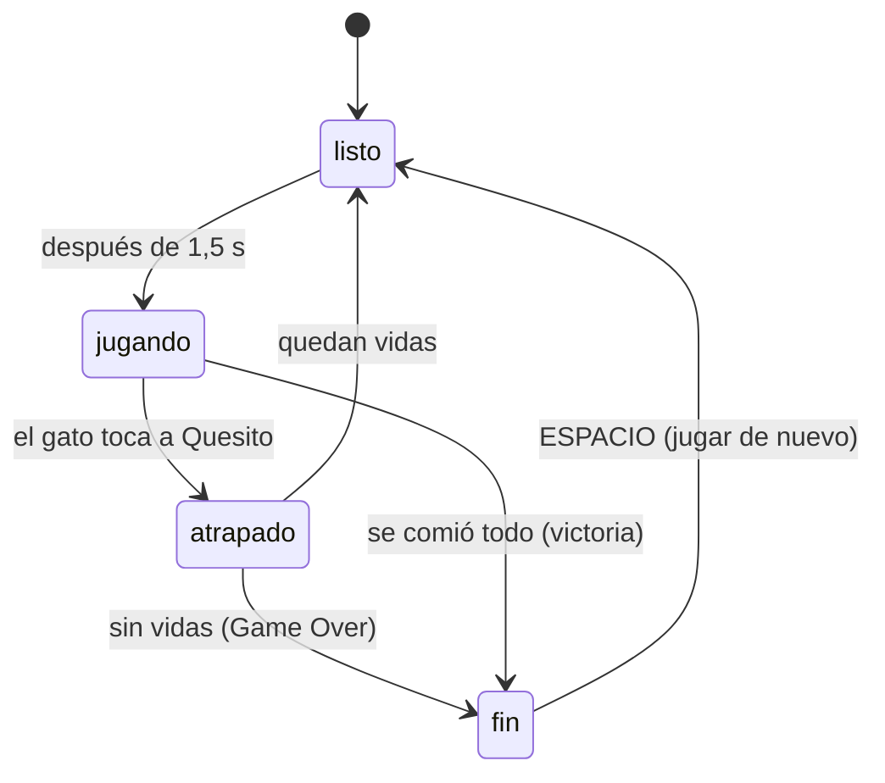

# Cómo funciona Corre Miau Miau

Este documento explica, en lenguaje simple, cada mecánica y algoritmo del juego: qué hace, dónde está el código y por qué se hizo así. Se actualiza cada vez que cambia algo.

> Los números (velocidades, probabilidades, tiempos, puntos) no están escritos en el código: viven en [`src/config/niveles.json`](../src/config/niveles.json). Así se ajusta la dificultad sin tocar la lógica.

---

## 1. El mapa es una grilla

**Archivo:** [`src/mapa/mapas.ts`](../src/mapa/mapas.ts) y [`src/sistemas/grilla.ts`](../src/sistemas/grilla.ts)

El laberinto se escribe como texto: cada carácter es una casilla (27 columnas × 19 filas).

| Carácter | Significa |
|---|---|
| `#` | muro o mueble |
| `.` | pasillo con queso |
| `o` | pepino |
| `c` | cafecito |
| `b` | caja de cartón |
| `=` | gatera (túnel lateral) |
| `Q` / `G` | donde parten Quesito y el gato |

La clase `Grilla` lee ese texto una vez y responde preguntas simples:

- `esMuro(x, y)`: ¿esta casilla está bloqueada?
- `vecino(x, y, dir)`: ¿qué casilla hay al lado en esa dirección?
- `puedeMover(x, y, dir)`: ¿puedo avanzar hacia allá?

**Las gateras:** `vecino` usa el operador módulo (`%`) para "dar la vuelta": si sales por la columna 0 hacia la izquierda, llegas a la columna 26. Así funcionan los túneles sin código especial.

Todo esto es **lógica pura**: no usa Phaser, así que se puede probar con tests automáticos.

---

## 2. Moverse de casilla en casilla

**Archivo:** [`src/sistemas/MovedorGrilla.ts`](../src/sistemas/MovedorGrilla.ts)

Quesito y los gatos usan la misma clase, `MovedorGrilla`. Cada personaje guarda:

- la casilla de donde salió (`x`, `y`),
- la dirección en que va (`dir`),
- cuánto avanzó hacia la casilla siguiente (`progreso`, de 0 a 1).

Cada fotograma avanza `velocidad × tiempo` casillas. La posición en pantalla es `casilla + dirección × progreso`, por eso **se ve suave aunque la lógica sea por casillas**.

Tres reglas hacen que se sienta bien de jugar, igual que en Pac-Man:

1. **Las decisiones se toman al llegar al centro de una casilla.** Nunca se gira a mitad de camino (así no se choca con esquinas).
2. **El giro queda guardado.** Si aprietas "arriba" antes de llegar al cruce, la dirección se guarda en `pedida` y se aplica apenas se pueda.
3. **Darse vuelta es inmediato.** Si pides la dirección contraria a mitad de camino, se intercambian origen y destino y el progreso pasa a `1 − progreso`.

Cada vez que llega al centro de una casilla, llama a `alLlegar(x, y)`. Quesito lo usa para comer; los gatos, para decidir hacia dónde seguir.

---

## 3. Cómo persigue Tomasito (nivel 1)

**Archivos:** [`src/ia/azar.ts`](../src/ia/azar.ts) y [`src/ia/bfs.ts`](../src/ia/bfs.ts)

Cada vez que Tomasito llega a una casilla, tira un "dado":

- **85% de las veces persigue:** sigue el camino más corto hacia Quesito, calculado con **BFS**.
- **15% de las veces se distrae:** elige al azar uno de los caminos libres.
- **Nunca se da vuelta** (salvo en un callejón sin salida), igual que los fantasmas de Pac-Man. Así no tiembla yendo y viniendo en un cruce, y si lo pasas por detrás tiene que dar toda la vuelta.

### BFS: búsqueda en anchura

BFS encuentra el camino más corto en un laberinto. Funciona como una **onda en el agua**:

1. Parte en la casilla del gato.
2. Visita todas las casillas a 1 paso, después todas las que están a 2 pasos, después a 3… usando una **cola** (el primero que entra es el primero que sale).
3. Marca cada casilla como visitada para no repetirla.
4. La primera vez que la onda toca a Quesito, ese es el camino más corto.

Truco del código: en vez de guardar el camino completo, cada casilla recuerda **con qué primer paso se llegó a ella**. Cuando la onda encuentra a Quesito, ese primer paso es la respuesta. El gato vuelve a calcular en cada casilla, así que siempre sigue a Quesito aunque se mueva.

- **Costo:** visita cada casilla una vez como máximo. El mapa tiene unas 300 casillas libres, así que es instantáneo.
- **Considera las gateras:** si el túnel es más corto, lo usa.
- **Por qué no "línea recta":** la primera versión elegía la casilla más cerca en línea recta de Quesito, pero cualquier muro lo despistaba. BFS recorre los pasillos de verdad.

### La siesta

Cada 18 a 28 segundos (un número al azar en ese rango), Tomasito se duerme 1,5 segundos: se queda quieto y su cabeza se inclina. Es su "personalidad" y le da respiro al jugador.

### Más lento en las gateras

Dentro de un túnel el gato va al 60% de su velocidad, como en Pac-Man: los túneles son una vía de escape para Quesito.

---

## 4. Atrapar a Quesito

**Archivo:** [`src/escenas/Juego.ts`](../src/escenas/Juego.ts), método `seTocan`

Se mide la distancia entre la posición continua de Quesito y la del gato. Si es menor que 0,6 casillas (`radioAtrapar`), el gato lo atrapó. En horizontal se usa la distancia más corta considerando la gatera, para que el túnel no sea un escondite mágico.

Al ser atrapado:

1. Se pierde una vida y el gato celebra.
2. Si quedan vidas, los dos vuelven a su casilla de inicio. El queso comido no vuelve.
3. Si no quedan, aparece **GAME OVER**.

---

## 5. Queso, puntaje y ganar

**Archivo:** [`src/sistemas/Despensa.ts`](../src/sistemas/Despensa.ts)

La `Despensa` guarda qué objeto hay en cada casilla (en un `Map` con clave `"x,y"`) y el puntaje.

| Objeto | Puntos | ¿Cuenta para ganar? |
|---|---|---|
| Queso | 10 | Sí |
| Pepino | 50 | Sí |
| Cafecito | 100 | No |
| Caja | — | No (no se come) |

Se gana cuando no queda queso ni pepinos. El cafecito es opcional.

---

## 6. Fases de una partida

**Archivo:** `Juego.ts`, tipo `Fase`

Una **máquina de estados** simple controla qué puede pasar en cada momento:

La pausa (ESPACIO) es aparte: congela cualquier fase.

---

## 7. Cámara, mini-mapa y mapa completo

- **Cámara:** sigue a Quesito con suavizado (`startFollow` con factor 0,12) y no sale de los bordes del mapa. El zoom es ×3, un número entero, para que los píxeles queden cuadrados.
- **Mini-mapa:** es una **segunda cámara** de Phaser con zoom chico que mira todo el mapa.
- **Mapa completo (M):** la cámara deja de seguir a Quesito y hace zoom para mostrar la habitación entera. El juego sigue corriendo.

---

## 8. Controles

| Tecla | Acción |
|---|---|
| Flechas o WASD | Mover a Quesito |
| M | Mapa completo / volver a la cámara |
| ESPACIO | Pausa (y jugar de nuevo al terminar) |
| ESC | Volver a elegir nivel |

---

## 9. Pixel art hecho con código

**Archivos:** [`src/arte/`](../src/arte/)

El arte no está dibujado en un programa: está **escrito en código**, píxel a píxel.

- [`paleta.ts`](../src/arte/paleta.ts): los únicos colores permitidos. Una paleta fija hace que todo combine.
- [`Lienzo.ts`](../src/arte/Lienzo.ts): una "hoja" de píxeles en memoria con herramientas básicas: rectángulo, óvalo, línea (algoritmo de **Bresenham**), tramado (dithering) y **contorno automático**, que pinta de oscuro cada píxel vacío que toca un píxel dibujado.
- [`primitivas.ts`](../src/arte/primitivas.ts): piezas reutilizables en **vista 3/4**:
  - una caja (mueble) tiene **tapa** (vista desde arriba, subida `alto` píxeles) y **cara frontal** (su altura);
  - un cilindro (maceta, taza, puf) es un rectángulo con un óvalo abajo y otro arriba;
  - la luz viene de arriba a la izquierda: bordes superiores e izquierdos más claros, derechos e inferiores más oscuros.
- [`personajes.ts`](../src/arte/personajes.ts): Quesito (frente, espalda y lado, con dos pasos) y los objetos.
- **Números "al azar" que siempre salen iguales:** la función `hash(a, b)` da un número entre 0 y 1 que depende solo de sus entradas. Sirve para variar hojas y libros sin que el dibujo cambie cada vez que se abre el juego.

El mismo código dibuja en el juego y en Node: `npm run arte` exporta los dibujos a `tools/salida/` para revisarlos como imagen.

---

## 10. Pruebas automáticas

`npm test` corre las pruebas con Vitest. Revisan, entre otras cosas:

- que el mapa tenga 27×19 y que **todas las casillas libres estén conectadas** (usando BFS);
- el movimiento suave, el giro guardado, la vuelta inmediata y las gateras;
- que BFS rodee muros, use gateras y siempre llegue a Quesito;
- que la IA de Tomasito no se dé vuelta y use todos los caminos cuando se distrae;
- el puntaje y la condición de victoria.
